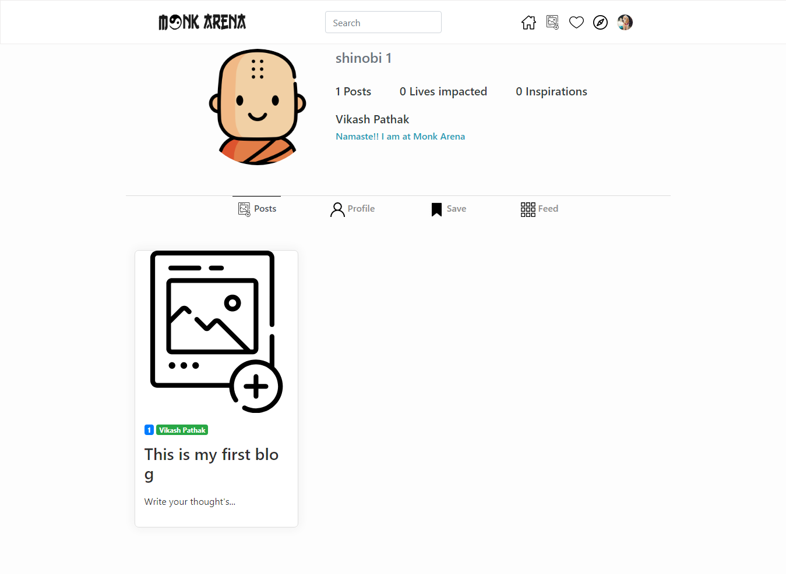

# Monk-arena

> A community for people who are interested in Monks perspectives,Idea of Peace and Martial arts to share their thoughts to inspire.

> We designed and developed a website solely dedicated for the people who are interested in Martial Arts,Yoga and Medtiation.

#### Project Screenshots

<table>
  <tr>
     <td>Feed Page </td>
  </tr>
  <tr>
    <td>Profile Page </td>
  </tr>
  <tr>
  <td>Profile Update Page</td>
  </tr>
 </table>

## Built With

- HTML 5 and CSS 3.
- Font awesome.
- Bootstrap
- Sass
- Javascript

## Live Demo

[Live Demo Link](https://0prodigy.github.io/monk-arena/)

## Getting Started

**Just fork it and feel free to use it.**

To get a local copy up and running follow these simple example steps.

### Prerequisites

Having a web browser, code editor and git.

### Install

Just fork it and you are good to go.

## Authors

👤 **Akash Pathak**

- Github: [@0prodigy](https://github.com/0prodigy)
- Twitter: [@pathakprodigy](https://twitter.com/pathakprodigy)
- Linkedin: [Akash Pathak](https://www.linkedin.com/in/akash-pathak-0796a7165)
- Email: (pathakvikash9211@gmail.com)

👤 **Sheelu Krishnatrayi**

- Github: [@gSheelu27](https://github.com/Sheelu27)
- Twitter: [@krishnatrayi](https://twitter.com/krishnatrayi)
- Linkedin: [Sheelu Krishnatrayi](https://www.linkedin.com/in/sheelu-krishnatrayi-87930a1a8/)
- Email: (sheelukumari27@gmail.com)

## 🤝 Contributing

Contributions, issues and feature requests are welcome!

Feel free to check the [issues page](https://0prodigy.github.io/monk-arena/issues).

## Show your support

Give a ⭐️ if you like this project!

## Acknowledgments

- We take all the responsiblity for every signle line of code. The desgin inspire from Instagram, Medium and Derrible.
